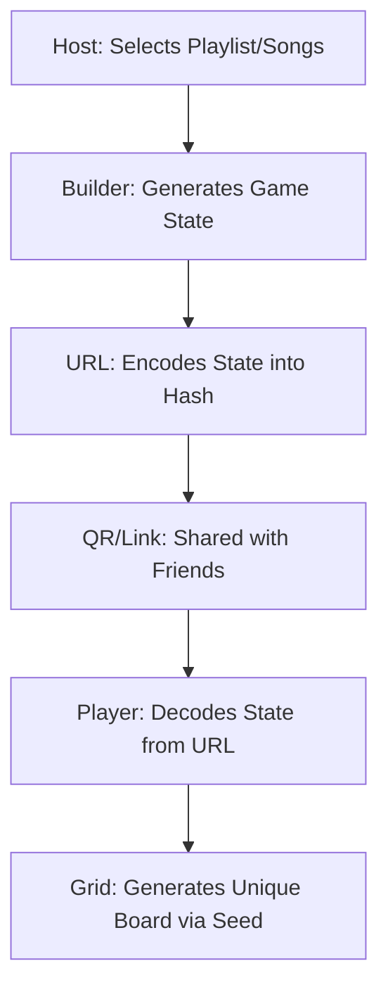

# 🎶 Gig Bingo - Technical Overview

Gig Bingo is a high-performance, mobile-first Progressive Web App (PWA) designed for creating and sharing music bingo cards for gigs, festivals, and parties. It uses a **serverless multiplayer** architecture powered entirely by URL-based state and seeded randomization.

## 🏗️ App Structure

The application is built using a vanilla technology stack for maximum performance and minimum dependencies.

### 🔌 Core Components

| Component | Responsibility |
| :--- | :--- |
| **`app.js`** | The main orchestrator. Manages the UI lifecycle, event listeners, and coordinates between different modules. |
| **`game-state.js`** | Handles URL-based state encoding/decoding. This is the "brain" of the serverless multiplayer system. |
| **`builder.js`** | Logic for the "Card Builder" feature, allowing users to select songs from the database or add custom entries. |
| **Spotify Integration** | `spotify-auth.js` (OAuth flow) and `spotify-api.js` (fetching playlists/tracks) allow importing external music data. |
| **Data Layers** | `song-database.js` provides a pre-cached song pool; `localStorage` persists check-states and builder drafts locally. |
| **Visuals & UX** | `index.html` (Modal-based UI), `style.css` (Neon/Dark aesthetics), and `qr-generator.js` for on-device sharing. |

## 🧬 Core Concepts

### 1. URL-Based State (Serverless Multiplayer)
All game information (mode, playlist ID, seed, custom songs) is encoded directly into the URL hash.
- **Join Link**: A single link shared by a host that allows any number of players to generate their own unique, fair board.
- **Frozen View**: A snapshot URL that includes the checked-state of a board, allowing users to "share progress" as a read-only view.

### 2. Seeded Randomization
To ensure all players use the **same pool of songs** but have **different grid layouts**, the app uses the `Mulberry32` algorithm (`seed-random.js`).
- The host generates a `seed` included in the URL.
- Each player generates a unique board by combining the game seed with their own local randomness (when joining) or by being assigned a permutation.

### 3. Offline-First (PWA)
Built with a Service Worker (`sw.js`) and Cache-First strategy.
- Prefetches core assets for 100% offline availability.
- "Classic" mode works entirely without an internet connection.
- Spotify modes require an initial connection to fetch track data but can be played offline once loaded.

## 🔄 Data Flow

### The Sharing Lifecycle

### The Progress Loop
1. **User Interaction**: Tapping a cell toggles the checked state.
2. **Persistence**: `app.js` updates `checkState` and saves to `localStorage` using a key bonded to the `gameId`.
3. **Scoring**: The app calculates real-time score (1pt per song, 3pts per line/bingo) and updates the UI.

## 🚀 Key Features

- **Spotify Import**: High-fidelity track data directly from User playlists.
- **Card Builder**: Search-and-add or manual input for custom songs.
- **Master Links**: One link for everyone, unique experience for each.
- **Progress Sharing**: Share your live score or a frozen snapshot of your board.
- **Haptic UI**: Vibration feedback and modern neon aesthetics.
